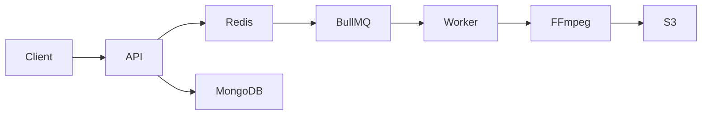

<div align="center">

# 🎥 YouTube Clone Backend

A scalable backend for a YouTube-like video streaming platform built with **Node.js**, **TypeScript**, **Express**, **MongoDB**, **Redis**, **BullMQ**, **Docker**, and **AWS**.

<p>
  
  
  
  
  
  
</p>

</div>

---

## 📖 Overview

This project is a production-inspired backend for a video streaming platform. It focuses on scalable architecture, asynchronous processing, secure authentication, and efficient media handling.

---

## ✨ Features

- 🔐 JWT Authentication
- 🎥 Video Upload API
- ⚡ Redis-based View Counter
- 🔄 BullMQ Background Jobs
- 🎬 FFmpeg HLS Transcoding
- ☁️ AWS S3 Storage
- 🐳 Docker Support
- 📊 MongoDB Aggregation & Indexing

---

## 🛠 Tech Stack

| Category | Technologies     |
| -------- | ---------------- |
| Runtime  | Node.js, Express |
| Language | TypeScript       |
| Database | MongoDB          |
| Cache    | Redis            |
| Queue    | BullMQ           |
| Storage  | AWS S3           |
| Media    | FFmpeg           |
| DevOps   | Docker           |

---

## 🏗 System Architecture



---

## 📁 Project Structure

```text
src/
├── config/
├── controllers/
├── middlewares/
├── models/
├── routes/
├── services/
├── utils/
└── index.ts
```

---

## 🚀 Getting Started

### Clone the repository

```bash
git clone https://github.com/your-username/backend-project.git
cd backend-project
```

### Install dependencies

```bash
npm install
```

### Configure environment

```env
PORT=5000
MONGODB_URI=
REDIS_URL=
ACCESS_TOKEN_SECRET=
REFRESH_TOKEN_SECRET=
AWS_ACCESS_KEY=
AWS_SECRET_KEY=
AWS_BUCKET_NAME=
```

### Start the development server

```bash
npm run dev
```

---

## 📈 Performance Optimizations

- Redis atomic counters for view tracking
- Background processing with BullMQ
- MongoDB indexing for fast queries
- Asynchronous media transcoding
- Chunked uploads with FFmpeg

---

## 🛣 Roadmap

- [x] Authentication
- [x] Video Upload
- [x] Redis Caching
- [x] Background Workers
- [ ] Recommendation Engine
- [ ] Live Streaming
- [ ] Notifications

---

## 🤝 Contributing

Contributions are welcome! Feel free to open an issue or submit a pull request.

---

## 📄 License

This project is licensed under the MIT License.
