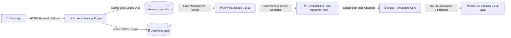

# 🎥 YouTube Clone Backend Engine

## Production-Grade, High-Throughput Media Streaming System

A scalable, decoupled video architecture designed to manage high-concurrency operations, asynchronous worker pools, and low-latency client delivery.


### 🗺️ Explore Live System Blueprints

[Explore Live System Blueprints & Eraser.io Architecture Workspace](https://app.eraser.io/workspace/nWRwZCZ290JSpgR5s04K)

---

## 📖 System Overview

This system is an enterprise-inspired streaming engine configured to balance rapid state distribution with decoupled data boundaries. It prioritizes optimal index scaling strategies, background ingestion management via asynchronous job loops, and non-blocking caching mechanisms to bypass direct-disk connection bottlenecks.

---

## ✨ Features Matrix

- **🔐 Multi-Tier Security Engine:** Dual-token JWT architecture managing secure access and rotation lifetimes via cryptographically decoupled payload verifications.
- **⚡ Atomic Micro-Caching:** Distributed real-time metadata mutation processing routing through volatile `O(1)` memory stores to shield system layer constraints.
- **🔄 Parallelized Queue Operations:** BullMQ event loop distribution handling CPU-intensive encoding workflows without stalling single-threaded application contexts.
- **🎬 Adaptive Streaming Orchestration:** Auto-chunking raw multi-part uploads into dynamic, stream-safe bit-rate configurations.
- **☁️ Object Topology Mapping:** Direct integration maps processing out file state references to cloud storage solutions with automated cleanup tasks.

---

## 🛠 Tech Stack Profiling

| Layer                   | Technologies Mapping         | Performance Focus                                               |
| :---------------------- | :--------------------------- | :-------------------------------------------------------------- |
| **Runtime & Language**  | Node.js, Express, TypeScript | Type-safe execution, highly optimized Event Loop utility        |
| **Databases**           | MongoDB, Mongoose ORM        | Document flexibility, inverted B-tree matching constraints      |
| **Caching & Messaging** | Redis, BullMQ                | Non-blocking persistence wrappers, low-friction microtask pools |
| **Media & Storage**     | FFmpeg, AWS S3 Cluster       | Segmented bit-rate processing, decoupled resource assets        |
| **DevOps Isolation**    | Docker, Compose Architecture | Replicable cluster environments, sandboxed datastores           |

---

## 🏗 System Architecture Flow



## 🗄️ Database Schema & Relational Entity Layout

Data boundaries rely on a highly optimized, inverted third-normal-form layout. Embedded tracking arrays are dropped to prevent document sizes from scaling past hard engine capacity thresholds under viral social interactions.

## 👤 Users Collection

| Field                     | Type                  |
| :------------------------ | :-------------------- |
| **id**                    | `string` (PK)         |
| **email**                 | `string`              |
| **username**              | `string`              |
| **fullName**              | `string`              |
| **avatar**                | `string`              |
| **coverImage**            | `string`              |
| **password**              | `string`              |
| **refreshToken**          | `string`              |
| **watchHistory**          | `ObjectId[] → videos` |
| **createdAt / updatedAt** | `Date`                |

---

## 🎥 Videos Collection

| Field                     | Type               |
| :------------------------ | :----------------- |
| **id**                    | `string` (PK)      |
| **owner**                 | `ObjectId → users` |
| **videoFile**             | `string`           |
| **thumbnail**             | `string`           |
| **title**                 | `string`           |
| **description**           | `string`           |
| **duration**              | `number`           |
| **views**                 | `number`           |
| **isPublished**           | `boolean`          |
| **createdAt / updatedAt** | `Date`             |

---

## 💳 Subscriptions Collection

| Field                     | Type               |
| :------------------------ | :----------------- |
| **id**                    | `string` (PK)      |
| **subscriber**            | `ObjectId → users` |
| **channel**               | `ObjectId → users` |
| **createdAt / updatedAt** | `Date`             |

---

## 👍 Likes Collection

| Field                     | Type                  |
| :------------------------ | :-------------------- |
| **id**                    | `string` (PK)         |
| **video**                 | `ObjectId → videos`   |
| **comment**               | `ObjectId → comments` |
| **tweet**                 | `ObjectId → tweets`   |
| **likedBy**               | `ObjectId → users`    |
| **createdAt / updatedAt** | `Date`                |

---

## 💬 Comments Collection

| Field                     | Type                |
| :------------------------ | :------------------ |
| **id**                    | `string` (PK)       |
| **video**                 | `ObjectId → videos` |
| **owner**                 | `ObjectId → users`  |
| **content**               | `string`            |
| **createdAt / updatedAt** | `Date`              |

---

## 📚 Playlists Collection

| Field                     | Type                  |
| :------------------------ | :-------------------- |
| **id**                    | `string` (PK)         |
| **owner**                 | `ObjectId → users`    |
| **videos**                | `ObjectId[] → videos` |
| **name**                  | `string`              |
| **description**           | `string`              |
| **createdAt / updatedAt** | `Date`                |

---

## 🐦 Tweets Collection

| Field                     | Type               |
| :------------------------ | :----------------- |
| **id**                    | `string` (PK)      |
| **owner**                 | `ObjectId → users` |
| **content**               | `string`           |
| **createdAt / updatedAt** | `Date`             |

---

## 🔗 Architectural Relationship Paths

- `users.watchHistory` → `videos.id` (Many-to-Many)
- `videos.owner` → `users.id`
- `subscriptions.subscriber` → `users.id`
- `subscriptions.channel` → `users.id`
- `likes.likedBy` → `users.id`
- `likes.video` → `videos.id`
- `likes.comment` → `comments.id`
- `likes.tweet` → `tweets.id`
- `comments.owner` → `users.id`
- `comments.video` → `videos.id`
- `playlists.owner` → `users.id`
- `playlists.videos` → `videos.id`
- `tweets.owner` → `users.id`

---

## 📈 System Optimizations

- **Atomic Cache Sharding:** Write operations bypass persistent database connections during traffic spikes using Redis `INCRBY`.
- **Logarithmic B-Tree Scans:** Fast indexed lookups with **O(log N)** complexity.
- **Inverted Relational Boundaries:** Prevents oversized MongoDB documents through normalized schema design.
- **Background Micro-Worker Loops:** CPU-intensive tasks are delegated to isolated BullMQ workers.

## 📁 Project Structure

```text
src/
├── config/         # System environment drivers (Mongoose, Redis clients)
├── controllers/    # Endpoint payload management & business logic layer
├── middlewares/    # Authentication validation & rate-limiting layers
├── models/         # Strongly typed model schemas with compound text indices
├── routes/         # Enterprise API directory mapping trees (/api/v1/*)
├── services/       # File transcoding pipelines & processing handlers
├── utils/          # Global handling patterns & error management helpers
└── index.ts        # App configuration root & microtask routing orchestrator
```

---

## 🚀 Getting Started

## Clone the Repository

```bash
git clone https://github.com/your-username/backend-project.git
cd backend-project
```

## Install Dependencies

```bash
npm install
```

## Configure Environment

Create a `.env` file in the project root.

```env
PORT=5000

MONGODB_URI=mongodb://localhost:27017/youtube-clone

REDIS_URL=redis://localhost:6379

ACCESS_TOKEN_SECRET=your_crypto_access_layer_token

REFRESH_TOKEN_SECRET=your_crypto_refresh_layer_token

AWS_ACCESS_KEY=your_iam_access_key

AWS_SECRET_KEY=your_iam_secret_key

AWS_BUCKET_NAME=your_s3_media_bucket
```

## Start Development Server

```bash
# Boot infrastructure
docker-compose up -d
```

```bash
# Start backend
npm run dev
```

---

## 🛣 Roadmap

- [x] JWT Dual-Token Authentication System
- [x] Multi-Part Chunked Media Processing
- [x] Non-Blocking Redis In-Memory Counters
- [x] Background Worker Processing with BullMQ
- [ ] Adaptive Recommendation Engine
- [ ] WebSocket Real-Time Notifications

---

## 🤝 Contributing

Contributions are welcome!

1. Fork the repository.
2. Create a feature branch.
3. Commit your changes.
4. Push the branch.
5. Open a Pull Request.

---

## 📄 License

This project is licensed under the **MIT License**.
