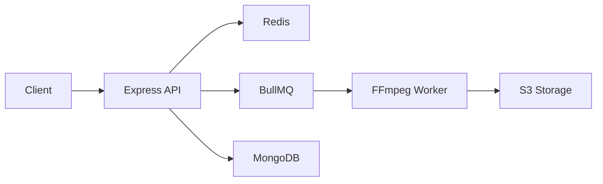
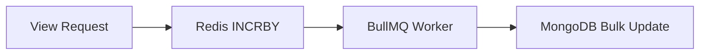

# 🎥 YouTube Clone Backend

> A scalable backend for a YouTube-like video streaming platform built with Node.js, Express, TypeScript, MongoDB, Redis, BullMQ, Docker, and AWS.


---

## ✨ Features

- JWT Authentication
- Video Upload API
- Redis-based View Counter
- BullMQ Background Workers
- FFmpeg Video Processing
- HLS Streaming
- MongoDB Aggregation
- AWS S3 Storage
- Docker Support
- TypeScript Architecture

---

# Architecture



---

## View Counter Flow



---

## Tech Stack

| Category | Technologies     |
| -------- | ---------------- |
| Runtime  | Node.js, Express |
| Language | TypeScript       |
| Database | MongoDB          |
| Cache    | Redis            |
| Queue    | BullMQ           |
| Storage  | AWS S3           |
| Video    | FFmpeg           |
| DevOps   | Docker           |

---

## Folder Structure

```text
src/
├── config/
├── controllers/
├── middlewares/
├── models/
├── routes/
├── services/
├── utils/
└── index.ts
```

---

## Installation

```bash
git clone <repo-url>

cd backend-project

npm install
```

---

## Environment Variables

```env
PORT=5000

MONGODB_URI=

REDIS_URL=

ACCESS_TOKEN_SECRET=

REFRESH_TOKEN_SECRET=

AWS_ACCESS_KEY=

AWS_SECRET_KEY=

AWS_BUCKET_NAME=
```

---

## Run with Docker

```bash
docker compose up -d
```

---

## Development

```bash
npm run dev
```

---

## API Endpoints

| Method | Endpoint               |
| ------ | ---------------------- |
| POST   | /api/v1/users/register |
| POST   | /api/v1/users/login    |
| GET    | /api/v1/videos         |
| POST   | /api/v1/videos         |
| POST   | /api/v1/comments       |
| GET    | /api/v1/health         |

---

## Performance Optimizations

- Redis atomic counters for views
- Background jobs with BullMQ
- MongoDB indexing
- Aggregation pipelines
- Chunked video uploads
- HLS transcoding
- Dockerized deployment
- TypeScript type safety

---

## Future Improvements

- Kubernetes Deployment
- CI/CD Pipeline
- Recommendation Engine
- Notifications
- WebSockets
- Analytics Dashboard

---

## License

MIT
